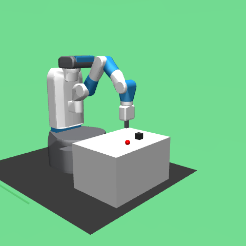
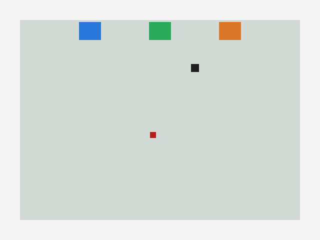

# Robot Sorting RL 초보자 실행 로드맵

## 이 문서의 목표

이 문서는 강화학습, 로봇, MuJoCo, Gymnasium, Stable-Baselines3를 모르는 사람이 그대로 따라가서 프로젝트를 진행할 수 있게 만드는 실행서다.

최종 목표는 다음 문장을 증거와 함께 말할 수 있는 상태다.

> 가상 로봇 분류 환경을 만들고, 강화학습으로 로봇을 훈련시켰으며, 저장된 모델을 다시 불러와 평가하고, 결과 영상과 수치로 검증했다.

중요한 원칙:

- 모르는 단어가 나와도 멈추지 않는다. 이 문서의 순서대로 실행한다.
- 성공했다고 말하려면 명령, 결과 파일, 평가 수치가 있어야 한다.
- 짧은 smoke 학습은 실행 경로 확인일 뿐이다. 모델 성능 증거로 쓰지 않는다.
- Windows PowerShell 명령과 WSL Ubuntu 명령을 섞지 않는다.
- "로봇팔 모델 확인"과 "강화학습 환경 확인"은 다른 단계다. 먼저 실제 로봇팔이 화면에 뜨는지 보고, 그다음 학습용 단순 환경으로 넘어간다.
- 현재 저장소가 실제로 지원하는 기본 경로는 TensorBoard와 `scripts/record_video.py`다.
- W&B, Docker Compose, `VecVideoRecorder`는 선택 고도화다. 기본 파이프라인이 된 뒤 붙인다.

## 가장 먼저: 내가 쓰는 터미널 고르기

이 프로젝트는 Windows PowerShell 또는 WSL Ubuntu 둘 중 하나로 진행할 수 있다. 한 번 고르면 그 터미널의 명령만 사용한다.

| 내 화면 | 사용 중인 터미널 | Python 명령 형태 |
| --- | --- | --- |
| `PS C:\Users\...>` | Windows PowerShell | `.\.venv\Scripts\python.exe -m pytest` |
| `(.venv) ubuntu@...:/mnt/c/...$` | WSL Ubuntu | `python -m pytest` |

지금 프롬프트가 아래처럼 보이면 WSL Ubuntu다.

```text
(.venv) ubuntu@DESKTOP-PBR33GS:/mnt/c/Users/user/Desktop/RobotRF$
```

이 경우 절대로 아래 Windows 명령을 쓰지 않는다.

```powershell
.\.venv\Scripts\python.exe -m pytest
```

WSL에서는 아래처럼 쓴다.

```bash
python -m pytest
```

명령 변환 규칙:

| Windows PowerShell | WSL Ubuntu |
| --- | --- |
| `.\.venv\Scripts\python.exe` | `python` |
| `.\.venv\Scripts\tensorboard.exe` | `tensorboard` |
| `checkpoints\smoke\stage1_sac.zip` | `checkpoints/smoke/stage1_sac.zip` |
| `videos\stage1_smoke_rollout.mp4` | `videos/stage1_smoke_rollout.mp4` |

현재처럼 `No Python at '"/usr/bin\python.exe'`가 나오면 `.venv`가 Windows/WSL 경로가 섞여 깨진 상태다. WSL에서 진행할 거라면 WSL용 `.venv`를 다시 만들어야 한다.

## 도구 지도

| 역할 | 도구 | 처음 보는 사람 기준 설명 | 이 프로젝트에서 쓰는 위치 | 필수 여부 |
| --- | --- | --- | --- | --- |
| 물리 시뮬레이터 | MuJoCo | 로봇과 물체 움직임을 물리적으로 계산하는 엔진 | `pyproject.toml` 의존성, `scripts/check_runtime.py` import 확인 | 필수 의존성 |
| 환경 API | Gymnasium | 강화학습 환경의 표준 입출력 규칙 | `src/robot_sorting_rl/envs/tabletop_sorting.py` | 필수 |
| 로봇 환경 도구 | Gymnasium-Robotics | 로봇 강화학습 예제와 GoalEnv 계열 도구 | `scripts/check_runtime.py` import 확인 | 필수 의존성 |
| 로봇팔 모델 | FetchPickAndPlace-v4 | Gymnasium-Robotics에 들어 있는 MuJoCo 로봇팔 예제 | `scripts/render_robotics_env.py` | 기본 확인용 |
| 로봇팔 모델 | Franka/Panda | 우리가 생각한 실제에 가까운 로봇팔 기종 | 아직 저장소에 모델 파일 없음 | 별도 통합 필요 |
| RL 알고리즘 | SAC + HER | 로봇이 시도하면서 배우는 학습 방법과 목표 재사용 기법 | `src/robot_sorting_rl/training.py` | 필수 |
| 학습 모니터링 | TensorBoard | 학습 로그를 그래프로 보는 도구 | `--tensorboard-log runs\...` | 기본 |
| 학습 모니터링 | W&B | 실험 결과를 웹 대시보드로 관리하는 도구 | `pip install -e .[wandb]` 후 선택 적용 | 선택 |
| 영상 녹화 | `scripts/record_video.py` + imageio | 저장된 모델을 실행해 mp4로 저장 | `scripts/record_video.py` | 기본 |
| 영상 녹화 | VecVideoRecorder + ffmpeg | Stable-Baselines3 벡터 환경 녹화 도구 | 아직 기본 스크립트는 아님 | 선택 고도화 |
| 개발 보조 | Codex | 코드/문서 수정과 오류 분석 보조자 | 이 저장소 작업 전반 | 선택이지만 적극 활용 |
| 배포/정리 | Docker Compose | 같은 실행 환경을 다른 컴퓨터에서도 재현하는 도구 | 아직 기본 구성 없음 | 선택 고도화 |

## 먼저 알아야 하는 단어

- 환경: 로봇이 연습하는 가상 공간이다. 책상, 물건, 박스, 로봇 손이 들어 있다.
- 관찰값: 로봇이 현재 상황을 숫자로 보는 정보다. 예: 로봇 손 위치, 물건 위치, 목표 박스 위치.
- 행동: 로봇이 할 수 있는 움직임이다. 이 프로젝트에서는 `dx`, `dy`, `dz`, `gripper` 네 값이다.
- 보상: 행동 결과에 대한 점수다. 성공하면 `0.0`, 실패 상태면 `-1.0`을 쓴다.
- 모델: 학습해서 얻은 행동 규칙 파일이다. `.zip` 체크포인트로 저장된다.
- 학습: 모델을 만드는 과정이다.
- 평가: 저장한 모델을 다시 불러와 여러 번 실행하고 성공률을 재는 과정이다.
- 체크포인트: 저장된 모델 파일이다.
- 로그: 학습 과정 기록이다. TensorBoard로 그래프를 볼 수 있다.
- 영상: 모델이 움직이는 결과를 사람이 볼 수 있게 저장한 mp4 파일이다.
- smoke 테스트: 성능이 아니라 "명령이 끝까지 실행되는지"만 확인하는 짧은 테스트다.

## 전체 진행 순서

| 단계 | 이름 | 목표 | 끝났다는 기준 |
| --- | --- | --- | --- |
| 0 | 현재 상태 확인 | 내 컴퓨터와 저장소 상태를 확인한다 | Python 경로, git 상태, 의존성 상태를 안다 |
| 1 | 개발 환경 복구 | `.venv`와 패키지를 정상화한다 | `check_runtime.py`와 pytest가 실행된다 |
| 2 | 도구 import 확인 | MuJoCo/Gymnasium/SB3가 불러와지는지 본다 | import 에러가 없다 |
| 3 | 로봇팔 모델 화면 확인 | MuJoCo 로봇팔 예제가 실제 이미지로 렌더되는지 본다 | `fetch_pick_and_place_snapshot.png`가 생긴다 |
| 4 | Stage 1 미션 확인 | 물건 1개를 박스 1개에 넣는 학습용 환경을 확인한다 | Stage 1 테스트가 통과한다 |
| 5 | 짧은 학습 | SAC+HER 학습 루프와 저장을 확인한다 | `stage1_sac.zip`이 생긴다 |
| 6 | 모델 로드 평가 | 저장한 모델을 다시 불러와 평가한다 | 성공률/평균 보상이 출력된다 |
| 7 | 영상 저장 | 평가 결과를 영상으로 남긴다 | mp4 파일이 생긴다 |
| 8 | Stage 2 분류 | 물건 종류별 3개 박스 분류 환경을 확인한다 | Stage 2 테스트가 통과한다 |
| 9 | 긴 학습 | 실제 성공률을 측정한다 | 평가 episode 수와 성공률이 기록된다 |
| 10 | 포트폴리오 정리 | 명령, 수치, 영상, 실패/해결을 정리한다 | README/기록 문서에 증거가 남는다 |
| 11 | 선택 고도화 | Franka, W&B, VecVideoRecorder, Docker를 붙인다 | 기본 파이프라인을 망치지 않고 확장된다 |

## 0단계: 현재 상태 확인

목표: 지금 막힌 지점이 코드인지, Python 환경인지, 설치 문제인지 구분한다.

### Windows PowerShell을 쓰는 경우

저장소 루트로 이동한다.

```powershell
cd C:\Users\user\Desktop\RobotRF
```

현재 변경 파일을 확인한다.

```powershell
git status --short
```

Python 경로를 확인한다.

```powershell
python --version
where python
```

프로젝트 가상환경 Python이 살아 있는지 확인한다.

```powershell
.\.venv\Scripts\python.exe --version
```

### WSL Ubuntu를 쓰는 경우

저장소 루트로 이동한다.

```bash
cd /mnt/c/Users/user/Desktop/RobotRF
```

현재 변경 파일을 확인한다.

```bash
git status --short
```

Python 경로를 확인한다.

```bash
python3 --version
which python3
```

프로젝트 가상환경이 켜져 있다면 Python 경로를 확인한다.

```bash
which python
python --version
```

정상 기준:

- Windows는 `python --version` 또는 `.\.venv\Scripts\python.exe --version`이 Python 3.10 이상을 보여준다.
- WSL은 `python3 --version` 또는 활성화된 가상환경의 `python --version`이 Python 3.10 이상을 보여준다.

현재 알려진 문제:

- `.venv`가 `No Python at '"/usr/bin\python.exe'`를 출력하면 Windows/WSL 경로가 섞여 가상환경이 깨진 것이다.
- 이 경우 학습, 평가, 테스트가 모두 막힌다. 1단계에서 `.venv`를 다시 만든다.

## 1단계: 개발 환경 복구

목표: 이 프로젝트를 실행할 Python 가상환경을 정상화한다.

### Windows PowerShell에서 복구

가상환경이 깨졌다면 `.venv`를 새로 만든다.

```powershell
python -m venv .venv
```

패키지를 설치한다.

```powershell
.\.venv\Scripts\python.exe -m pip install --upgrade pip
.\.venv\Scripts\python.exe -m pip install -e .[dev]
```

Windows 준비 상태를 확인한다.

```powershell
powershell -NoProfile -ExecutionPolicy Bypass -File .\scripts\check_windows_bootstrap.ps1
```

정상 기준:

- `.venv` Python이 실행된다.
- `pip install -e .[dev]`가 끝난다.
- bootstrap 스크립트가 치명적 오류 없이 끝난다.

막혔을 때:

- `python`을 못 찾으면 Python 설치부터 해결한다.
- `pip install`에서 MuJoCo나 torch 설치가 막히면 에러 마지막 20줄을 기록한다.
- 이 단계가 안 되면 다음 단계로 가지 않는다.

### WSL Ubuntu에서 복구

현재 WSL 프롬프트가 아래처럼 보이면 이 절차를 사용한다.

```text
(.venv) ubuntu@DESKTOP-PBR33GS:/mnt/c/Users/user/Desktop/RobotRF$
```

먼저 켜져 있는 깨진 가상환경에서 나온다.

```bash
deactivate
```

깨진 `.venv`를 지우고 WSL용으로 다시 만든다.

```bash
rm -rf .venv
python3 -m venv .venv
source .venv/bin/activate
```

필요 패키지를 설치한다.

```bash
python -m pip install --upgrade pip
python -m pip install -e '.[dev]'
```

런타임을 확인한다.

```bash
python scripts/check_runtime.py
python -m pytest
```

WSL 정상 기준:

- `which python` 결과가 `/mnt/c/Users/user/Desktop/RobotRF/.venv/bin/python` 비슷하게 나온다.
- `python scripts/check_runtime.py`가 import 에러 없이 끝난다.
- `python -m pytest`가 실행된다.

WSL에서 절대 쓰지 않을 명령:

```powershell
.\.venv\Scripts\python.exe -m pytest
```

이 명령은 Windows PowerShell용이다. WSL에서는 `python -m pytest`를 쓴다.

## 2단계: 도구 import 확인

목표: MuJoCo, Gymnasium, Gymnasium-Robotics, Stable-Baselines3가 실제로 불러와지는지 확인한다.

실행한다.

```powershell
.\.venv\Scripts\python.exe scripts\check_runtime.py
```

WSL Ubuntu에서는 이렇게 실행한다.

```bash
python scripts/check_runtime.py
```

전체 테스트도 실행한다.

```powershell
.\.venv\Scripts\python.exe -m pytest
```

WSL Ubuntu에서는 이렇게 실행한다.

```bash
python -m pytest
```

이 단계에서 확인하는 도구:

- MuJoCo: 물리 시뮬레이션 엔진이 설치됐는지 확인한다.
- Gymnasium: 강화학습 환경 API가 설치됐는지 확인한다.
- Gymnasium-Robotics: 로봇 환경 관련 패키지가 설치됐는지 확인한다.
- Stable-Baselines3: SAC 학습 코드가 실행될 수 있는지 확인한다.
- TensorBoard: 학습 로그 저장과 시각화 준비가 됐는지 확인한다.

정상 기준:

- `scripts/check_runtime.py`가 import 에러 없이 끝난다.
- pytest가 통과한다.

막혔을 때:

- `ModuleNotFoundError`면 설치가 빠진 것이다. `pip install -e .[dev]`를 다시 실행한다.
- MuJoCo import 에러면 설치 로그와 OS 정보를 기록한다.
- pytest 실패면 실패한 테스트 이름과 에러 메시지를 기록한다.

## 3단계: MuJoCo 로봇팔 모델 화면 확인

목표: 시뮬레이션 툴이 켜지고, 로봇팔 모델이 실제 이미지로 렌더되는지 확인한다.

이 단계는 사용자가 처음 기대한 단계다.

```text
시뮬레이션 실행 -> 로봇팔 모델 로드 -> 화면/이미지로 움직일 수 있는 장면 확인
```

먼저 정확히 구분해야 한다.

| 질문 | 현재 답 |
| --- | --- |
| MuJoCo가 실행되는가? | 확인 가능 |
| Gymnasium-Robotics 로봇팔 예제를 로드할 수 있는가? | 확인 가능 |
| 로봇팔 장면을 이미지로 볼 수 있는가? | 확인 가능 |
| 그 로봇팔이 Franka/Panda인가? | 아직 아님 |
| Franka/Panda 모델 파일이 저장소에 있는가? | 없음 |

현재 저장소에서 바로 확인 가능한 로봇팔은 `FetchPickAndPlace-v4`다. 이것은 Franka가 아니라 Gymnasium-Robotics에 포함된 Fetch 로봇팔 예제다.

왜 Fetch부터 확인하는가:

- MuJoCo 렌더가 되는지 확인할 수 있다.
- Gymnasium-Robotics 환경 등록이 되는지 확인할 수 있다.
- 로봇팔, 물체, 목표 위치가 있는 실제 로봇 강화학습 예제를 볼 수 있다.
- Franka를 붙이기 전에 "내 컴퓨터가 로봇 시뮬레이션을 띄울 수 있는지"를 먼저 검증할 수 있다.

### 따라 하기: Fetch 로봇팔 장면 이미지 만들기

WSL Ubuntu:

```bash
python scripts/render_robotics_env.py --env-id FetchPickAndPlace-v4 --output docs/fetch_pick_and_place_snapshot.png
```

Windows PowerShell:

```powershell
.\.venv\Scripts\python.exe scripts\render_robotics_env.py --env-id FetchPickAndPlace-v4 --output docs\fetch_pick_and_place_snapshot.png
```

정상 출력 예시:

```text
saved snapshot: docs/fetch_pick_and_place_snapshot.png
env_id: FetchPickAndPlace-v4
info_keys: []
```

이미지 파일:



이 이미지가 생기면 다음을 확인한 것이다.

- MuJoCo가 설치되어 있다.
- Gymnasium-Robotics 환경을 등록할 수 있다.
- 로봇팔 모델이 로드된다.
- 렌더링 결과를 이미지로 저장할 수 있다.

아직 확인하지 않은 것:

- Franka/Panda 로봇팔은 아직 로드하지 않았다.
- 우리 Stage 1 학습 환경이 이 로봇팔을 직접 쓰는 것은 아니다.
- 현재 Stage 1 학습 환경은 학습 파이프라인을 먼저 검증하기 위한 단순 2D/kinematic MVP다.

Franka/Panda를 쓰려면 나중에 별도 작업이 필요하다.

1. Franka/Panda MuJoCo XML 또는 MJCF 모델 파일을 저장소에 추가한다.
2. 해당 모델을 불러오는 Gymnasium 환경을 만든다.
3. 관절 제어, 집게 제어, 물체 접촉, 성공 판정을 연결한다.
4. 기존 SAC+HER 학습 코드가 새 환경을 쓰도록 연결한다.

이 단계가 끝났다는 기준:

- `docs/fetch_pick_and_place_snapshot.png`가 생긴다.
- 이미지에 로봇팔 장면이 보인다.
- "현재는 Fetch로 로봇 시뮬레이션 실행을 확인했고, Franka는 아직 통합 전"이라고 구분해서 말할 수 있다.

## 4단계: Stage 1 첫 번째 로봇 미션 확인

목표: "로봇이 어떤 상황에서 무엇을 해야 하는지"를 사람 눈높이로 이해하고, 코드가 그 상황을 제대로 만들었는지 확인한다.

이 단계에서는 아직 로봇을 학습시키지 않는다. 먼저 로봇이 연습할 게임판이 제대로 만들어졌는지 확인한다.

쉽게 말하면:

- 강화학습은 게임처럼 생각하면 된다.
- 환경은 게임판이다.
- 로봇 손은 플레이어 캐릭터다.
- 물건은 옮겨야 하는 아이템이다.
- 박스는 목적지다.
- Stage 1은 튜토리얼 스테이지다.

### Stage 1에서 실제로 벌어지는 상황

책상 위에 다음 물체들이 있다.

| 화면 속 대상 | 코드 이름 | 쉬운 설명 |
| --- | --- | --- |
| 로봇 손 | `gripper_position` | 물건을 집으러 움직이는 손 |
| 검은 물건 1개 | `object_position` | 박스까지 옮겨야 하는 물건 |
| 목표 박스 1개 | `desired_goal` | 물건이 도착해야 하는 위치 |
| 성공 거리 | `success_threshold` | 물건이 박스에 충분히 가까운지 보는 기준 |

Stage 1 미션:

- 물건은 1개만 나온다.
- 목표 박스도 1개만 쓴다.
- 로봇 손은 물건을 잡고 목표 박스 근처로 가져가야 한다.
- 물건이 목표 박스 중심에서 `0.05` 안으로 들어오면 성공이다.

여기서 `0.05`는 코드 안의 숫자 기준이다. 현실 감각으로는 "목표 위치에 충분히 가까워졌다" 정도로 이해하면 된다.

### 먼저 눈으로 보기

숫자와 코드부터 보면 감이 안 온다. 먼저 Stage 1 장면을 이미지로 저장한다.

WSL Ubuntu:

```bash
python scripts/render_snapshot.py --stage 1 --output docs/stage1_snapshot.png
```

Windows PowerShell:

```powershell
.\.venv\Scripts\python.exe scripts\render_snapshot.py --stage 1 --output docs\stage1_snapshot.png
```

정상 출력 예시:

```text
saved snapshot: docs/stage1_snapshot.png
stage: 1
object_type: 0
```

이미지 파일:



이미지에서 볼 것:

- 연한 회색 큰 사각형: 로봇이 움직이는 책상 공간.
- 검은 작은 사각형: 옮겨야 하는 물건.
- 빨간 작은 사각형: 로봇 손.
- 위쪽 색깔 박스들: 목표 박스 위치.
- Stage 1에서는 첫 번째 박스 하나만 목표로 쓴다.

이 이미지를 보고 "로봇 손이 검은 물건을 목표 박스 쪽으로 옮기는 문제"라고 이해하면 된다.

### 로봇이 한 번 움직일 때 일어나는 일

로봇에게 행동 4개 숫자를 준다.

```text
[x방향 움직임, y방향 움직임, z방향 움직임, 집게 열기/닫기]
```

예를 들어:

```text
[1, 0, 0, -1]
```

뜻:

- `1`: x방향으로 조금 움직인다.
- `0`: y방향은 움직이지 않는다.
- `0`: z방향은 움직이지 않는다.
- `-1`: 집게를 닫는다.

코드에서는 이것을 `action`이라고 부른다. 지금은 직접 잘 조종하려는 단계가 아니다. "환경이 이런 행동을 받을 준비가 되어 있는지"를 확인하는 단계다.

### 로봇이 보는 정보

로봇은 사람처럼 화면을 보는 것이 아니라 숫자 묶음을 본다.

```text
observation = 로봇 손 위치 + 물건 위치 + 목표 박스 위치 + 물건 종류 + 들고 있는지 여부
```

Stage 1에서는 물건 종류가 항상 `0`이다. 아직 분류 문제가 아니기 때문이다.

테스트에서는 이 숫자 묶음의 길이가 `13`인지 확인한다.

```text
로봇 손 위치 3개
물건 위치 3개
목표 박스 위치 3개
물건 종류 표시 3개
들고 있는지 여부 1개
= 총 13개
```

### 성공과 실패가 정해지는 방식

Stage 1은 복잡한 점수제가 아니다.

| 상황 | 보상 | 끝나는가 |
| --- | --- | --- |
| 물건이 목표 박스에 충분히 가까움 | `0.0` | 성공으로 종료 |
| 아직 목표 박스에서 멂 | `-1.0` | 계속 진행 |
| 최대 step을 다 씀 | 실패로 종료 | 종료 |

즉 로봇은 매번 `-1.0`을 피하고, 빨리 `0.0` 성공 상태에 도달하는 방향으로 학습하게 된다.

구현 위치:

- 환경 파일: `src/robot_sorting_rl/envs/tabletop_sorting.py`
- 환경 클래스: `TabletopSortingEnv`
- Stage 1 생성법: `TabletopSortingEnv(stage=1)`
- 학습 연결: `src/robot_sorting_rl/training.py`의 `make_env(stage=1)`
- 테스트 파일: `tests/test_tabletop_sorting_env.py`

### 따라 하기 1: Stage 1 환경을 한 번 만들어 보기

WSL Ubuntu에서는 아래 명령을 실행한다.

```bash
python -c "from robot_sorting_rl.envs import TabletopSortingEnv; env=TabletopSortingEnv(stage=1); obs,info=env.reset(seed=7); print('obs keys:', obs.keys()); print('observation length:', len(obs['observation'])); print('achieved_goal:', obs['achieved_goal']); print('desired_goal:', obs['desired_goal']); print('info:', info)"
```

Windows PowerShell에서는 앞의 `python`을 `.\.venv\Scripts\python.exe`로 바꾼다.

```powershell
.\.venv\Scripts\python.exe -c "from robot_sorting_rl.envs import TabletopSortingEnv; env=TabletopSortingEnv(stage=1); obs,info=env.reset(seed=7); print('obs keys:', obs.keys()); print('observation length:', len(obs['observation'])); print('achieved_goal:', obs['achieved_goal']); print('desired_goal:', obs['desired_goal']); print('info:', info)"
```

출력에서 봐야 할 것:

- `obs keys`에 `observation`, `achieved_goal`, `desired_goal`이 보인다.
- `observation length`가 `13`이다.
- `info`에 `'stage': 1`이 보인다.
- `info`에 `'object_type': 0`이 보인다.

이 출력의 뜻:

- 환경이 Stage 1로 만들어졌다.
- 로봇이 볼 숫자 정보가 준비됐다.
- 물건의 현재 위치와 목표 위치가 따로 존재한다.
- 아직 분류가 아니므로 물건 종류는 0으로 고정됐다.

### 따라 하기 2: 코드에서 목표 박스가 1개로 고정되는지 확인하기

```powershell
Select-String -Path .\src\robot_sorting_rl\envs\tabletop_sorting.py -Pattern "target_index = 0 if self.stage == 1 else self.object_type"
```

WSL Ubuntu에서는 같은 확인을 이렇게 해도 된다.

```bash
grep -n "target_index = 0 if self.stage == 1 else self.object_type" src/robot_sorting_rl/envs/tabletop_sorting.py
```

확인할 내용:

- `stage == 1`이면 `target_index`가 `0`이다.
- 즉 Stage 1에서는 항상 첫 번째 박스만 목표다.
- 그래서 첫 번째 미션은 "분류"가 아니라 "하나의 목표 위치로 옮기기"다.

### 따라 하기 3: 로봇이 보는 숫자 정보가 코드에 있는지 확인하기

```powershell
Select-String -Path .\src\robot_sorting_rl\envs\tabletop_sorting.py -Pattern "self.gripper_position|self.object_position|self.desired_goal"
```

WSL Ubuntu:

```bash
grep -n "self.gripper_position\|self.object_position\|self.desired_goal" src/robot_sorting_rl/envs/tabletop_sorting.py
```

확인할 내용:

- `self.gripper_position`: 로봇 손 위치.
- `self.object_position`: 물건 위치.
- `self.desired_goal`: 목표 박스 위치.

이 3개가 있어야 로봇이 "내 손은 어디 있고, 물건은 어디 있고, 어디로 가져가야 하는지"를 알 수 있다.

### 따라 하기 4: 성공 판정이 거리 기준인지 확인하기

```powershell
Select-String -Path .\src\robot_sorting_rl\envs\tabletop_sorting.py -Pattern "success_threshold|is_success|compute_reward"
```

WSL Ubuntu:

```bash
grep -n "success_threshold\|is_success\|compute_reward" src/robot_sorting_rl/envs/tabletop_sorting.py
```

확인할 내용:

- `success_threshold`는 성공 거리 기준이다.
- `compute_reward`는 보상을 계산한다.
- `is_success`는 성공 여부다.

쉽게 말하면:

```text
물건 위치와 목표 위치 사이 거리가 success_threshold 이하인가?
맞으면 성공.
아니면 아직 실패.
```

### 따라 하기 5: Stage 1 테스트 실행하기

WSL Ubuntu:

```bash
python -m pytest tests/test_tabletop_sorting_env.py::test_stage1_reset_returns_goal_env_observation tests/test_tabletop_sorting_env.py::test_step_reports_success_when_object_reaches_desired_goal -q
```

Windows PowerShell:

```powershell
.\.venv\Scripts\python.exe -m pytest tests\test_tabletop_sorting_env.py::test_stage1_reset_returns_goal_env_observation tests\test_tabletop_sorting_env.py::test_step_reports_success_when_object_reaches_desired_goal -q
```

정상 기준:

- `test_stage1_reset_returns_goal_env_observation`가 통과한다.
- `test_step_reports_success_when_object_reaches_desired_goal`가 통과한다.
- 출력 마지막에 `2 passed`가 보인다.

두 테스트가 확인하는 것:

- 첫 번째 테스트: Stage 1 게임판이 제대로 만들어지는가.
- 두 번째 테스트: 물건이 목표 위치에 도착하면 성공으로 처리되는가.

### 이 단계에서 이해해야 할 한 문장

Stage 1은 "로봇 손, 물건, 목표 박스가 있는 작은 책상 게임판을 만들고, 물건이 목표 박스에 가까워지면 성공이라고 판정하는지 확인하는 단계"다.

이 단계에서 아직 학습은 하지 않는다. 환경이 맞는지 먼저 확인한다.

## 4단계: SAC + HER로 짧은 학습 실행

목표: 모델 성능이 아니라 학습 루프, TensorBoard 로그, 체크포인트 저장이 되는지 확인한다.

사용하는 도구:

- SAC: Stable-Baselines3의 강화학습 알고리즘.
- HER: 목표 기반 로봇 문제에서 실패 경험도 재사용하는 replay buffer.
- TensorBoard: 학습 로그 저장.

실행한다.

```powershell
.\.venv\Scripts\python.exe scripts\train.py --stage 1 --algo sac --total-timesteps 1000 --output-dir checkpoints\smoke --tensorboard-log runs\smoke
```

명령 뜻:

- `--stage 1`: 첫 번째 쉬운 미션을 학습한다.
- `--algo sac`: SAC 알고리즘을 쓴다.
- `--total-timesteps 1000`: 아주 짧게 1000 step만 학습한다.
- `--output-dir checkpoints\smoke`: 모델 파일 저장 위치다.
- `--tensorboard-log runs\smoke`: 학습 로그 저장 위치다.

정상 기준:

- `saved checkpoint: checkpoints\smoke\stage1_sac.zip` 같은 출력이 나온다.
- `checkpoints\smoke\stage1_sac.zip` 파일이 생긴다.
- `runs\smoke` 폴더가 생긴다.

파일을 확인한다.

```powershell
Test-Path .\checkpoints\smoke\stage1_sac.zip
Get-ChildItem .\runs\smoke
```

주의:

- 1000 step은 거의 연습하지 않은 수준이다.
- 성공률이 낮아도 학습 파이프라인 확인에는 정상일 수 있다.
- 이 결과를 포트폴리오에 "로봇이 잘한다"는 증거로 쓰면 안 된다.

## 5단계: 저장된 모델 로드와 평가

목표: 저장된 체크포인트를 다시 불러와 평가할 수 있는지 확인한다.

실행한다.

```powershell
.\.venv\Scripts\python.exe scripts\evaluate.py --stage 1 --checkpoint checkpoints\smoke\stage1_sac.zip --episodes 5
```

출력 예시는 JSON 형태다.

```json
{
  "episodes": 5,
  "mean_episode_length": 50.0,
  "mean_reward": -50.0,
  "success_rate": 0.0
}
```

정상 기준:

- `episodes`, `success_rate`, `mean_reward`, `mean_episode_length`가 출력된다.
- 체크포인트 파일을 못 찾는 에러가 없다.
- 평가가 끝까지 실행된다.

기록해야 할 것:

- 실행 명령.
- checkpoint 경로.
- episode 수.
- success_rate.
- mean_reward.
- mean_episode_length.

주의:

- smoke 모델의 `success_rate`가 낮아도 이상하지 않다.
- 성능 증거는 8단계의 긴 학습과 충분한 평가 episode로 만든다.

## 6단계: 영상 저장

목표: 저장된 모델이 움직이는 모습을 mp4로 남긴다.

현재 저장소 기본 영상 경로:

- `scripts/record_video.py`
- 내부 저장 라이브러리: `imageio`
- 출력: mp4 파일

실행한다.

```powershell
.\.venv\Scripts\python.exe scripts\record_video.py --stage 1 --checkpoint checkpoints\smoke\stage1_sac.zip --output videos\stage1_smoke_rollout.mp4
```

파일을 확인한다.

```powershell
Test-Path .\videos\stage1_smoke_rollout.mp4
```

정상 기준:

- `saved video: videos\stage1_smoke_rollout.mp4`가 출력된다.
- mp4 파일이 생긴다.

ffmpeg 관련 주의:

- `imageio`가 mp4 저장 과정에서 ffmpeg를 필요로 할 수 있다.
- mp4 저장이 실패하면 `ffmpeg` 설치 상태를 확인한다.
- Windows에서 막히면 WSL2 Ubuntu에서 영상 생성을 다시 시도한다.

`VecVideoRecorder`는 언제 쓰는가:

- Stable-Baselines3 벡터 환경으로 여러 episode를 체계적으로 녹화할 때 쓴다.
- 현재 기본 스크립트는 `VecVideoRecorder`가 아니다.
- 기본 파이프라인이 끝난 뒤 고도화 작업으로 바꾸는 것이 안전하다.

## 7단계: Stage 2 분류 미션 확인

목표: 단순히 넣는 문제에서 물건 종류별로 맞는 박스를 고르는 문제로 확장한다.

Stage 2 미션:

- 물건 종류가 0, 1, 2 중 하나다.
- 박스는 3개다.
- 물건 종류에 따라 목표 박스가 달라진다.

테스트를 실행한다.

```powershell
.\.venv\Scripts\python.exe -m pytest tests\test_tabletop_sorting_env.py::test_stage2_uses_object_type_to_select_target_box
```

전체 환경 테스트도 다시 실행한다.

```powershell
.\.venv\Scripts\python.exe -m pytest tests\test_tabletop_sorting_env.py
```

정상 기준:

- `object_type`이 2일 때 `box_centers[2]`가 목표가 되는 테스트가 통과한다.
- 잘못된 박스를 성공으로 처리하지 않는다.

Stage 2를 직접 생성한다.

```powershell
.\.venv\Scripts\python.exe -c "from robot_sorting_rl.envs import TabletopSortingEnv; env=TabletopSortingEnv(stage=2); obs,info=env.reset(seed=3, options={'object_type': 2}); print(obs['desired_goal']); print(env.box_centers[2]); print(info)"
```

이 단계가 끝나야 Stage 2 학습을 시작한다.

## 8단계: 긴 학습과 성공률 측정

목표: 실제로 쓸 만한 모델인지 수치로 확인한다.

Stage 1 긴 학습 예시:

```powershell
.\.venv\Scripts\python.exe scripts\train.py --stage 1 --algo sac --total-timesteps 50000 --seed 42 --output-dir checkpoints\stage1 --tensorboard-log runs\stage1
```

Stage 1 평가:

```powershell
.\.venv\Scripts\python.exe scripts\evaluate.py --stage 1 --checkpoint checkpoints\stage1\stage1_sac.zip --episodes 100
```

Stage 2 긴 학습 예시:

```powershell
.\.venv\Scripts\python.exe scripts\train.py --stage 2 --algo sac --total-timesteps 50000 --seed 42 --output-dir checkpoints\stage2 --tensorboard-log runs\stage2
```

Stage 2 평가:

```powershell
.\.venv\Scripts\python.exe scripts\evaluate.py --stage 2 --checkpoint checkpoints\stage2\stage2_sac.zip --episodes 100
```

기록해야 할 것:

- stage.
- 알고리즘: SAC.
- HER 사용 여부: `HerReplayBuffer` 사용.
- seed.
- total_timesteps.
- checkpoint 경로.
- TensorBoard log 경로.
- 평가 episodes.
- success_rate.
- mean_reward.
- mean_episode_length.

주의:

- 성공률을 측정하지 않았으면 성공했다고 쓰지 않는다.
- 한 seed 결과만으로 일반화 성능을 주장하지 않는다.
- 실패한 결과도 기록한다. 실패 원인을 찾는 과정이 포트폴리오 가치가 된다.

## 9단계: TensorBoard로 학습 로그 보기

목표: 학습이 어떻게 진행됐는지 그래프로 확인한다.

TensorBoard를 실행한다.

```powershell
.\.venv\Scripts\tensorboard.exe --logdir runs
```

브라우저에서 연다.

```text
http://localhost:6006
```

확인할 것:

- 학습 run이 보이는가.
- reward나 loss 관련 그래프가 기록되는가.
- Stage 1과 Stage 2 로그 폴더가 구분되는가.

캡처할 것:

- TensorBoard 화면.
- 어떤 명령으로 만든 로그인지.
- 로그 폴더 경로.

## 10단계: 포트폴리오 자료 정리

목표: 결과를 말이 아니라 증거로 정리한다.

반드시 남길 항목:

```text
단계:
명령:
stage:
algorithm:
seed:
timesteps:
checkpoint:
tensorboard_log:
episodes:
success_rate:
mean_reward:
mean_episode_length:
video:
검증 상태:
막힌 문제:
해결 방법:
```

예시:

```text
단계: Stage 1 smoke 학습
명령: .\.venv\Scripts\python.exe scripts\train.py --stage 1 --algo sac --total-timesteps 1000 --output-dir checkpoints\smoke --tensorboard-log runs\smoke
stage: 1
algorithm: SAC + HER
seed: 42
timesteps: 1000
checkpoint: checkpoints\smoke\stage1_sac.zip
tensorboard_log: runs\smoke
episodes: 아직 평가 전
success_rate: 아직 측정 전
mean_reward: 아직 측정 전
mean_episode_length: 아직 측정 전
video: 아직 생성 전
검증 상태: checkpoint 생성 확인
막힌 문제: 없음
해결 방법: 없음
```

README나 Notion에 쓰면 좋은 문장:

```text
Robot Sorting RL은 물건을 목표 박스에 넣는 GoalEnv 스타일의 로봇 강화학습 MVP다.
Stage 1에서는 물건 1개와 목표 박스 1개로 저장/로드/평가 파이프라인을 검증하고,
Stage 2에서는 물건 종류에 따라 3개 박스 중 올바른 목표를 선택하도록 확장한다.
성공률, 평균 보상, 체크포인트, TensorBoard 로그, rollout 영상을 증거로 남긴다.
```

## 11단계: 선택 고도화

기본 파이프라인이 통과한 뒤에만 진행한다.

### Franka/Panda 로봇팔 통합

사용자가 처음 생각한 "시뮬레이션 툴을 실행하고 로봇팔 모델을 로드해서 실제 움직임을 확인"에 가장 가까운 목표다.

현재 상태:

- MuJoCo와 Gymnasium-Robotics는 설치 확인 가능하다.
- `FetchPickAndPlace-v4` 로봇팔 예제는 이미지로 확인 가능하다.
- Franka/Panda 모델은 아직 저장소에 없다.
- 현재 Stage 1 학습 환경은 Franka가 아니라 단순화한 테이블탑 MVP다.

Franka/Panda를 붙일 때 해야 할 일:

1. Franka/Panda MuJoCo XML 또는 MJCF asset을 저장소에 추가한다.
2. `src/robot_sorting_rl/envs/` 아래에 Franka용 환경 파일을 만든다.
3. 로봇 관절 제어와 집게 제어를 Gymnasium `action_space`로 연결한다.
4. 물건 위치, 목표 위치, 성공 판정을 GoalEnv 형태로 연결한다.
5. `scripts/render_robotics_env.py`처럼 먼저 스냅샷을 저장한다.
6. 그다음 SAC+HER 학습 코드에 연결한다.

이 고도화의 완료 기준:

- Franka/Panda 로봇팔이 렌더 이미지나 영상에 보인다.
- 관절 또는 집게가 명령에 따라 움직인다.
- 물건과 목표 위치가 환경 관찰값에 들어간다.
- 학습 전에 reset/step/render 테스트가 통과한다.

### W&B

언제 쓰는가:

- 여러 실험을 비교하고 싶을 때.
- TensorBoard 로그보다 웹 기반 실험 관리가 필요할 때.

설치:

```powershell
.\.venv\Scripts\python.exe -m pip install -e .[wandb]
```

주의:

- 현재 기본 학습 스크립트에는 W&B logging 코드가 직접 연결되어 있지 않다.
- 먼저 TensorBoard로 결과를 확인한 뒤 W&B 통합을 추가한다.

### VecVideoRecorder + ffmpeg

언제 쓰는가:

- Stable-Baselines3 벡터 환경 녹화 방식으로 바꾸고 싶을 때.
- 여러 episode를 자동으로 녹화하고 싶을 때.

주의:

- 현재 기본 영상 스크립트는 `imageio` 기반이다.
- `VecVideoRecorder` 전환은 코드 변경 작업이다. 기본 학습/평가/영상 저장이 된 뒤 진행한다.

### Docker Compose

언제 쓰는가:

- 다른 컴퓨터에서도 같은 환경으로 실행하고 싶을 때.
- Python, MuJoCo, ffmpeg 설치 차이를 줄이고 싶을 때.

주의:

- 현재 기본 로드맵에는 Docker Compose가 필요 없다.
- 로컬 실행이 먼저 안정화되어야 Docker로 묶을 수 있다.

## 막혔을 때 판단표

| 증상 | 원인 후보 | 먼저 할 일 |
| --- | --- | --- |
| `No Python at '"/usr/bin\python.exe'` | `.venv`가 깨짐 | 1단계에서 `.venv` 재생성 |
| `ModuleNotFoundError` | 패키지 미설치 | `pip install -e .[dev]` 재실행 |
| MuJoCo import 실패 | MuJoCo 설치/OS 문제 | `scripts/check_runtime.py` 출력 기록 |
| pytest 실패 | 환경 계약 또는 테스트 불일치 | 실패한 테스트 이름과 traceback 기록 |
| checkpoint 없음 | 학습 명령 실패 | `scripts\train.py` 출력 확인 |
| 평가가 checkpoint를 못 찾음 | 경로 불일치 | `Test-Path`로 파일 확인 |
| mp4 저장 실패 | ffmpeg/imageio 문제 | ffmpeg 설치 확인, WSL2 재시도 |
| 성공률 낮음 | 학습 부족 또는 환경 어려움 | timesteps, seed, stage, reward 기록 |

## Codex에게 물어봐야 할 때 붙여넣을 형식

가능하면 이 문서만 보고 진행한다. 그래도 막히면 아래 형식으로 붙여넣는다.

```text
목표 단계:
실행한 명령:
전체 에러 중 마지막 30줄:
생성된 파일:
기대한 결과:
실제 결과:
내가 바꾸지 않은 파일:
```

## 지금 당장 우선순위

1. `.venv` 복구.
2. `scripts/check_runtime.py` 실행.
3. `pytest` 실행.
4. Stage 1 환경 생성 확인.
5. Stage 1 smoke 학습.
6. Stage 1 checkpoint 로드 평가.
7. Stage 1 영상 저장.
8. Stage 2 환경 테스트.
9. Stage 1/2 긴 학습과 성공률 기록.
10. TensorBoard 캡처와 포트폴리오 정리.
